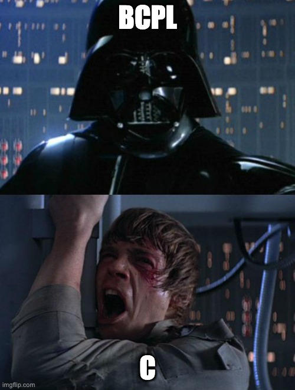
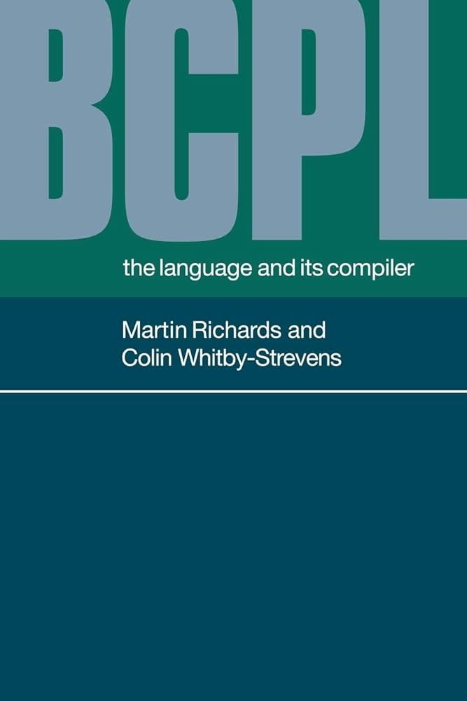
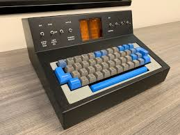

#!./slides.py

# BCPL: C, I am your father



*by Andrew Dong*

BCPL (Basic Combined Programming Language)

------------------------

# What is BCPL?

- A procedural, imperative, and structured programming language
- Predecessor to B language, which led to C
- Curly braces (but no keyboards for curlies)
- One data type: a word



------------------------

# Hello World

- BCPL is the language in which the original "Hello, World!" program was written

```bcpl
GET "LIBHDR"
LET START() BE WRITES("Hello, World")
```

---

# Key Features of BCPL

1. **Word-oriented language**
   - Single data type: the machine word
   - No type checking
   - Everything is treated as a bit pattern

2. **Syntax influenced C**
   - Curly braces for blocks
   - Function declarations
   - Similar operators

---

# Word-oriented language

    - The language is unusual in having only one data type: a word
    - For many machines of the time, this data type was a 16-bit word. 
    - This choice later proved to be a significant problem 
    when BCPL was used on machines in which the smallest 
    addressable item was not a word but a byte.  

---

# Curly braces

   - BCPL was the first brace programming language.  
   - In practice, on limited keyboards of the day, 
   source programs often used the sequences $( and $) 
   or [ and ] in place of the symbols { and }.




---

# Multi-User Dungeon

   - The first MUD was also written in BCPL (MUD1)
   - Trubshaw named the game Multi-User Dungeon, 
   in tribute to the Dungeon variant of Zork


---

# Relationship to C

   - Programmers at the time debated whether an 
   eventual successor to C would be called "D", 
    the next letter in the alphabet, or "P"


---

# BCPL for leetcode?

```bcpl
GET "LIBHDR"

GLOBAL $(
	COUNT: 200
	ALL: 201
$)

LET TRY(LD, ROW, RD) BE
	TEST ROW = ALL THEN
		COUNT := COUNT + 1
	ELSE $(
		LET POSS = ALL & ~(LD | ROW | RD)
		UNTIL POSS = 0 DO $(
			LET P = POSS & -POSS
			POSS := POSS - P
			TRY(LD + P << 1, ROW + P, RD + P >> 1)
		$)
	$)

LET START() = VALOF $(
	ALL := 1
	FOR I = 1 TO 12 DO $(
		COUNT := 0
		TRY(0, 0, 0)
		WRITEF("%I2-QUEENS PROBLEM HAS %I5 SOLUTIONS*N", I, COUNT)
		ALL := 2 * ALL + 1
	$)
	RESULTIS 0
$)
```
---

# BCPL Today


   - Martin Richards maintains a modern version of BCPL 
   on his website, last updated in 2023
   - This can be set up to run on various systems including 
   Linux, FreeBSD, and Mac OS X. 
   - The latest distribution includes graphics and sound 
   libraries, and there is a comprehensive manual. 
   - He continues to program in it, including for his 
   research on musical automated score following.

---

# **The book of BCPL**

*The philosophy of BCPL is not one of the tyrant*
*who thinks he knows best and lays down the law on*
*what is and what is not allowed.*

*Rather, BCPL acts more as a servant*
*offering his services to the best of his ability without complaint*
*even when confronted with apparent nonsense.*
*The programmer is always assumed to know*
*what he is doing and is not hemmed in by petty restrictions.*
